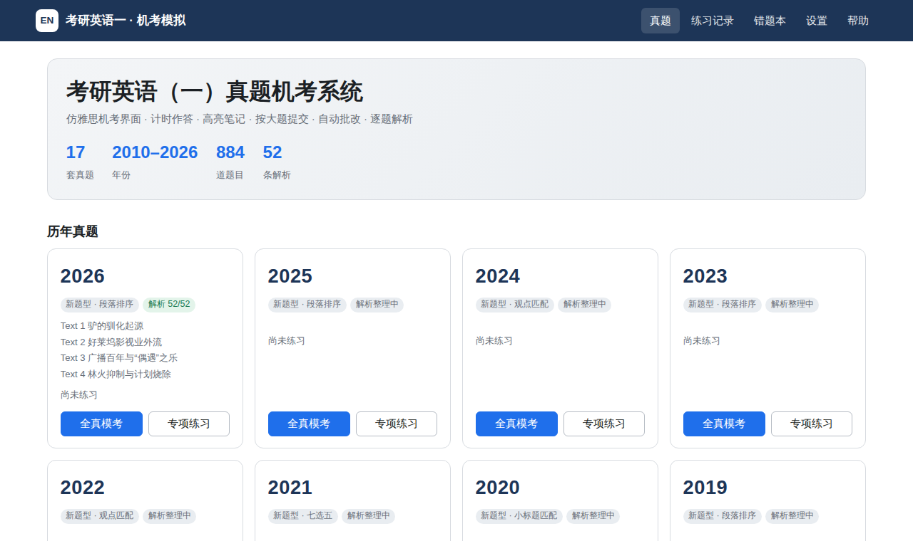
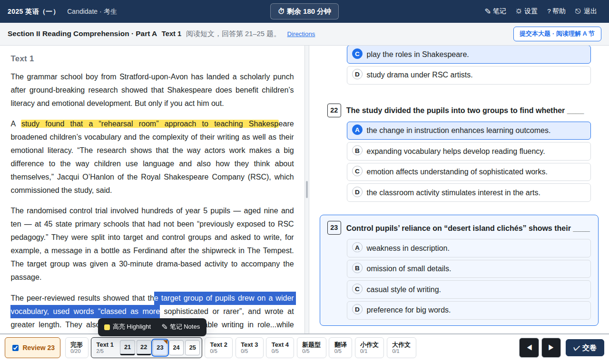
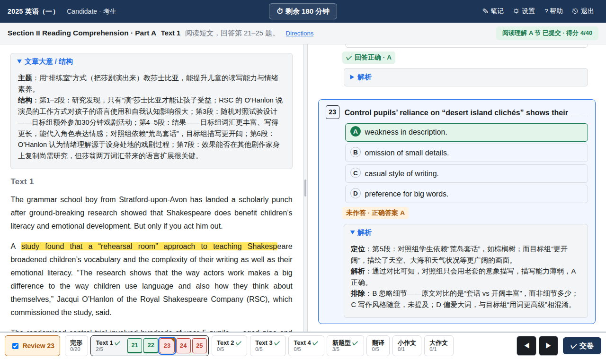
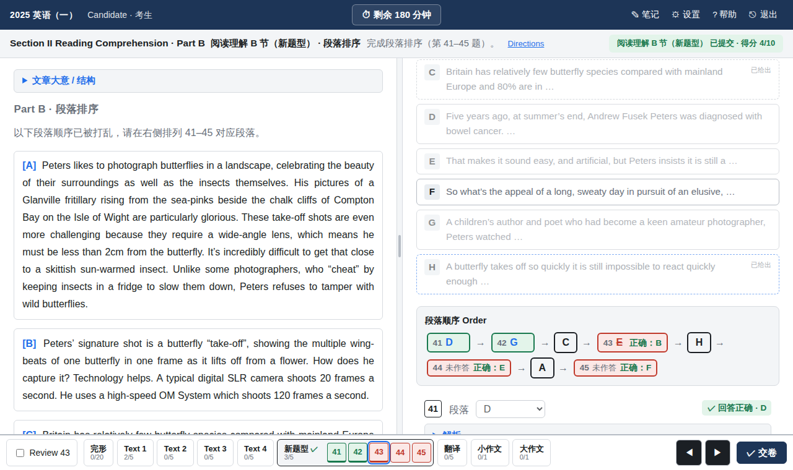
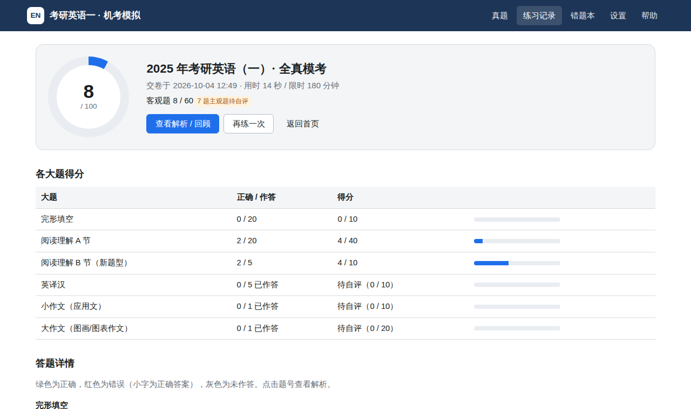

# 考研英语（一）真题机考系统

仿 **雅思机考（IELTS on computer）** 界面的考研英语（一）在线做题系统。收录 **2010–2026 年共 17 套** 英语一真题（每套 52 题），支持计时、高亮笔记、按大题提交、客观题自动批改，并为每一道题撰写了原创中文解析、参考译文与范文。



## 功能

**仿雅思机考界面**
- 顶栏：考生信息、倒计时（可点击隐藏）、笔记 / 设置 / 帮助 / 退出
- 左右分栏：左侧原文、右侧题目，中间分隔条可拖动调整宽度（双击复原）
- 底部导航：按部分（完形、Text 1–4、新题型、翻译、小作文、大作文）列出题号，显示已答 / 未答 / 标记状态；◀ ▶ 切换上一题 / 下一题
- **Review** 标记：勾选后题号右上角出现标记，方便交卷前回看
- 设置：字号（小 / 标准 / 大 / 特大）、配色（白底黑字 / 黑底白字 / 黑底黄字）

**计时**
- 全真模考 180 分钟倒计时，剩余 10 分钟、5 分钟提醒，计时结束自动交卷
- 专项练习可自定义时长，或选择不限时（正计时）；练习模式可暂停
- 进度与计时自动保存在浏览器本地，刷新、关闭后可继续作答

**高亮与笔记**
- 选中原文或题干文字，在弹出菜单中选择「高亮」或「笔记」（也支持右键）
- 点击已有高亮可清除或编辑笔记；顶栏「笔记」汇总查看全部笔记
- 高亮按字符位置保存，刷新、切换部分、提交后都会保留

**按大题提交与自动批改**
- 完形、阅读 Text 1–4（每篇单独）、新题型、翻译、小作文、大作文均可单独提交，只锁定并批改这一部分，其余部分不受影响
- 客观题自动判分（完形 0.5 分/题，阅读与新题型 2 分/题）；原文空格、选项、题号按钮以红绿色标出对错
- 翻译、写作提交后显示参考译文 / 范文和评分档次说明，可对照自评分数，计入总分
- 「交卷」一次性提交剩余大题并生成成绩报告：总分、各大题得分、逐题对错网格

**题型交互**
- 完形填空：点击原文空格定位题目，所选单词实时填回原文
- 新题型（七选五 / 小标题 / 段落排序 / 观点匹配）：选项可拖放到空位，或点击选项再点击空位，或用下拉框选择；同一选项只能使用一次
- 写作：实时词数统计

**解析**
- 每篇文章的「文章大意 / 结构」
- 完形：句意 + 解析 + 逐项排除；阅读：定位 + 解析 + 干扰项分析；新题型：衔接线索
- 翻译：参考译文 + 句子结构 + 难点与采分点；写作：审题思路 + 原创范文 + 亮点表达

**其他**
- 练习记录（可导出 / 导入 JSON 备份）、错题本（汇总已提交大题中的错题，一键跳转解析）
- 专项练习自由组合：如只练完形、阅读四篇、某一篇 Text、翻译、写作等
- 移动端自适应（原文 / 题目切换标签页）
- 键盘：`←` `→` 切换题目，`A`–`D` 为当前完形/阅读题作答

| 作答（高亮 + Review 标记） | 提交后查看解析 |
| --- | --- |
|  |  |
|  |  |

## 快速开始

纯静态网站，无需构建、无运行时依赖：

```bash
python3 -m http.server 8000      # 或 npm start
# 浏览器打开 http://localhost:8000
```

> 直接双击 `index.html` 打开时，浏览器会阻止页面读取 `data/` 下的 JSON，请务必通过任意静态服务器访问。

在线版：<https://xu-jack11.github.io/Kaoyan_English/>

推送到 `main` 分支时，`.github/workflows/pages.yml` 会先校验数据，再自动发布到 GitHub Pages（仓库 Settings → Pages 的 Source 需设为 **GitHub Actions**）。也可以部署到任何其他静态托管服务。

## 目录结构

```
index.html               入口
assets/css/app.css       样式（含三种配色、四档字号、移动端）
assets/js/
  main.js                路由
  home.js                首页、专项练习配置、练习记录、错题本
  exam.js                机考界面：分栏、计时、导航、作答、按大题提交、解析展示
  highlight.js           高亮与笔记引擎
  result.js              成绩报告
  data.js / store.js     数据加载与评分 / 本地存储
  dialogs.js / util.js   设置、帮助对话框与工具函数
data/
  index.json             试卷索引（由 tools/build_index.py 生成）
  papers/YYYY.json       真题：原文、题目、选项、答案
  explanations/YYYY.json 解析：文章大意、逐题解析、参考译文、范文
  img/                   写作题配图
tools/
  import_sources.py      从公开数据集导入真题（一次性）
  build_index.py         校验全部数据并生成 data/index.json
  patch.py               校对真题文本时使用的小工具
tests/e2e.mjs            Playwright 端到端测试
```

## 数据格式

`data/papers/YYYY.json` 由 6 个大题（section）组成，每个大题含若干组（group，即导航中的一个部分）：

| section | type | group | 题号 | 分值 |
| --- | --- | --- | --- | --- |
| `cloze` | cloze | `cloze` | 1–20 | 0.5 × 20 |
| `readingA` | reading | `text1`–`text4` | 21–40 | 2 × 20 |
| `readingB` | partB（`subtype`: gap_fill / heading / ordering / matching） | `partB` | 41–45 | 2 × 5 |
| `translation` | translation | `partC` | 46–50 | 2 × 5 |
| `writingA` | writing | `writingA` | 51 | 10 |
| `writingB` | writing | `writingB` | 52 | 20 |

原文中 `{{n}}` 表示第 n 题的空格 / 空位，`<u>…</u>` 表示翻译划线句；写作题目 `prompt` 按行渲染，`> ` 开头为信件引用块，`|` 开头为表格，`## ` 开头为图题。

`data/explanations/YYYY.json`：`summaries`（各部分文章大意）、`questions`（1–45 为解析字符串；46–50 为 `{ref, analysis}`；51–52 为 `{sample, analysis}`），支持 `**粗体**` 与换行。

修改任何数据后运行：

```bash
python3 tools/build_index.py          # 校验 + 重新生成 data/index.json
python3 tools/build_index.py --check  # 仅校验
```

校验内容包括：题号与分值完整、完形空格与题号一一对应、选项与答案合法、新题型空位/排序设置、翻译划线句与题目一致、配图存在、解析字段完整等。

## 测试

```bash
npm install            # 安装 playwright（仅测试需要）
npx playwright install chromium
npm test
```

端到端测试覆盖：开始模考与倒计时、完形作答与空格联动、Review 标记、高亮持久化、新题型拖放 / 点击放置 / 下拉选择与选项唯一性、写作词数、按大题提交与判分、交卷报告、错题本、翻译自评计分、倒计时结束自动交卷。

## 数据来源与校对

真题文本与答案收集自以下公开数据集：

- [LIziak112/structured-kaoyan-english](https://github.com/LIziak112/structured-kaoyan-english) —— 2010–2025 年英语一题目与答案（该项目「试题数据层」声明可自由使用；其「解析数据层」为 CC BY-NC 第三方内容，**本项目未使用**）
- [XixiGod7/kaoyan-english](https://github.com/XixiGod7/kaoyan-english)（MIT License, Copyright (c) 2026 XixiGod7）—— 2026 年题目、答案与翻译划线位置
- [wssfk12138/english-question-banks](https://github.com/wssfk12138/english-question-banks) —— 仅用于交叉核对答案、段落划分和文本（该题库为官方试卷的 OCR 版本），未直接复制其内容

校对过程：

1. 三个来源的客观题答案逐题交叉比对（按选项内容而非字母比对，避免选项顺序差异）；不一致处查证后确定，例如 2013 年完形第 6 题按 “soft **on** crime” 定为 D，2019 年第 40 题为 A，2022 年完形第 9 题为 A（analogous）。
2. 原文与 OCR 版官方试卷逐词比对，修正漏句、错词、段落拆分（阅读题常考「第 N 段」，段落编号必须准确）以及 PDF 换行、空格等格式问题。
3. 选项顺序与官方试卷一致：源数据中 2020、2021 年部分题目的选项顺序被打乱，已按官方试卷恢复，答案字母随之调整（如 2021 年新题型答案为 G C E B D）。
4. 词汇题所指的词语（原卷以「Line N, Para. M」定位）在原文中加下划线标出，方便在网页中定位。
5. 写作题目重新排版（信件、表格、图题）；2026 年大作文图表依据原题数据重绘为 SVG。

## 解析说明

全部 884 条解析（17 套 × 52 题）、参考译文、范文均为本项目原创撰写，未摘抄任何教辅或网络解析。个别存在争议的题目（如 2013 年第 27 题）在解析中注明了争议并以官方答案为准。如发现错误，欢迎提交 Issue 或 Pull Request（修改后请运行 `python3 tools/build_index.py` 校验）。

## 版权声明

考研英语真题的著作权归原文作者及国家教育考试主管部门所有，本项目收录仅供个人学习与交流使用，请勿用于商业用途。如有权利人认为内容侵权，请联系删除。
